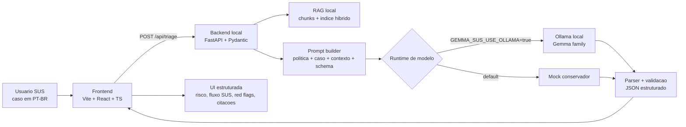
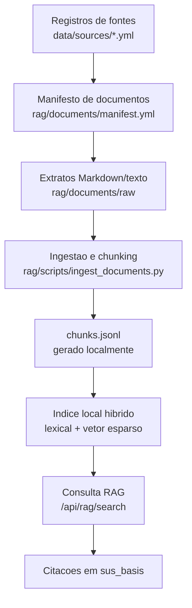
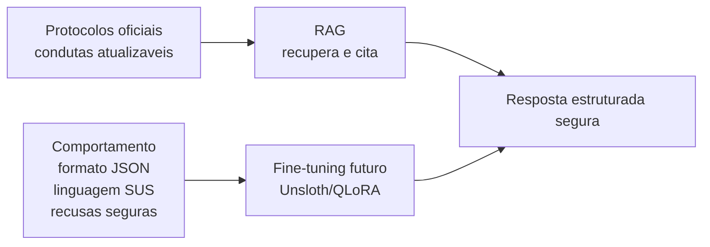

# Gemma SUS Assistant

Assistente web **local-first** para fluxos clinico-administrativos do SUS. O projeto combina interface React, backend FastAPI, RAG local sobre materiais publicos/oficiais, saidas JSON estruturadas e runtime local via Ollama/Gemma quando habilitado.

> Este projeto nao e um produto de diagnostico automatico. Ele apoia triagem, orientacao administrativa, roteamento SUS, documentacao e seguranca operacional. A resposta sempre deve preservar limites claros: nao substitui avaliacao profissional, nao prescreve medicamentos controlados e deve escalar sinais de alarme para UPA, emergencia ou SAMU 192 conforme o caso.

## Ideia do projeto

Modelos generalistas costumam entender mal o contexto brasileiro de saude publica. Termos como **UBS**, **UPA**, **SAMU**, **acolhimento**, **classificacao de risco**, **regulacao**, **receituario azul**, **PA 18x12** e **encaminhamento** carregam regras operacionais e linguagem local que nao aparecem bem em demos medicas genericas.

O Gemma SUS Assistant resolve isso com uma proposta simples:

- Rodar localmente sempre que possivel.
- Usar protocolos e materiais oficiais recuperados por RAG, nao memorizados pelo modelo.
- Gerar uma resposta estruturada e validavel para a interface.
- Explicar em portugues brasileiro o encaminhamento sugerido.
- Manter uma trilha futura de fine-tuning apenas para comportamento, formato, estilo, seguranca e terminologia.

## Para quem e

- Profissionais e equipes de UBS/UPA que precisam organizar fluxo e orientacao.
- Equipes administrativas lidando com encaminhamento, renovacao, regulacao e duvidas operacionais.
- Avaliadores de hackathon interessados em IA local, SUS e saude publica.
- Desenvolvedores criando ferramentas com RAG, Ollama, FastAPI, React e validacao de seguranca.

## O que a demo faz hoje

1. Recebe um caso curto em portugues brasileiro.
2. Consulta um indice RAG local com extratos curados e citaveis.
3. Monta um prompt com politica de seguranca, caso do usuario, contexto recuperado e schema JSON.
4. Usa Ollama quando `GEMMA_SUS_USE_OLLAMA=true`; caso contrario, usa runtime mock conservador.
5. Valida a resposta estruturada com Pydantic.
6. Renderiza risco, encaminhamento, sinais de alarme, base SUS, limitacoes, aviso de seguranca e JSON bruto.

Exemplo de entrada:

```text
Paciente relata PA 18x12, cefaleia forte e falta de ar. Esta na UBS.
```

Exemplo de saida estruturada:

```json
{
  "risk_level": "emergency",
  "summary": "Paciente com pressao arterial muito elevada associada a sintomas de alarme.",
  "suggested_action": "Encaminhar para atendimento de urgencia conforme fluxo local.",
  "referral": "UPA",
  "red_flags": ["falta de ar", "cefaleia forte", "pressao arterial muito elevada"],
  "sus_basis": ["Contexto oficial recuperado via RAG"],
  "limitations": "Esta orientacao nao substitui avaliacao profissional.",
  "safety_notice": "Acionar urgencia se houver piora, falta de ar, dor no peito ou outros sinais graves.",
  "runtime": "mock"
}
```

## Arquitetura em alto nivel



## Fluxo RAG

O RAG guarda conhecimento oficial e atualizado. Fine-tuning nao deve memorizar protocolos que precisam ser citaveis.



Principios do RAG:

- Preferir fontes oficiais federais: Ministerio da Saude, Linhas de Cuidado, PCDT, RENAME, CONITEC, BVS MS, DataSUS/CNES quando aplicavel.
- Preservar URL, publicador, data de recuperacao e metadados de citacao.
- Manter downloads grandes e arquivos brutos locais fora do Git.
- Commitar apenas extratos pequenos, curados e com proveniencia.

## Separacao entre RAG e fine-tuning



- **RAG**: fatos de protocolo, base oficial, citacoes e contexto local.
- **Fine-tuning**: estilo, disciplina de schema, portugues brasileiro, terminologia e padroes de seguranca.
- **Regra de seguranca**: nao treinar em prontuarios reais ou dados identificaveis sem ADR, autorizacao, desidentificacao e politica LGPD.

## Contrato de saida

A resposta de triagem segue campos estaveis:

```json
{
  "risk_level": "low | moderate | high | emergency",
  "summary": "string",
  "suggested_action": "string",
  "referral": "UBS | UPA | SAMU | emergency | scheduled_follow_up | administrative_guidance | unknown",
  "red_flags": ["string"],
  "sus_basis": ["string"],
  "limitations": "string",
  "safety_notice": "string",
  "runtime": "mock | ollama | mock_fallback"
}
```

Regras importantes:

- `red_flags` e `sus_basis` sempre sao arrays.
- `limitations` deve deixar claro que a resposta nao substitui avaliacao profissional.
- `safety_notice` deve orientar escalonamento diante de piora ou sintomas graves.
- Quando RAG for usado para protocolo, `sus_basis` deve apontar o contexto recuperado.

## Endpoints principais

| Metodo | Endpoint | Funcao |
|---|---|---|
| `GET` | `/api/health` | Status do backend, runtime e indice RAG |
| `POST` | `/api/triage` | Recebe `case_text` e retorna orientacao estruturada |
| `POST` | `/api/rag/search` | Busca trechos locais citaveis no indice RAG |

## Estrutura do repositorio

```text
app/frontend   Interface Vite + React + TypeScript
app/backend    API local FastAPI, schemas, runtime, RAG orchestration
rag            Fontes, ingestao, chunking, indice e testes RAG
evals          Casos deterministicos de seguranca SUS
finetuning     Datasets sinteticos e esqueleto Unsloth/QLoRA
docs           Guias de aquisicao, demo e metodologia
specs          Memoria persistente do produto, arquitetura e validacao
tasks          Estado de execucao e backlog
scripts        Validacao e loops de desenvolvimento
```

## Como rodar localmente

### Backend

```bash
cd app/backend
python -m venv .venv
. .venv/bin/activate
pip install -e .[dev]
uvicorn app.main:app --reload --port 8000
```

### Frontend

```bash
cd app/frontend
npm install
npm run dev
```

Por padrao, o frontend espera o backend em `http://localhost:8000`. Para alterar:

```bash
VITE_API_BASE_URL=http://localhost:8000 npm run dev
```

### Ollama local opcional

O backend usa mock conservador por padrao. Para habilitar Ollama:

```bash
GEMMA_SUS_USE_OLLAMA=true \
GEMMA_SUS_OLLAMA_BASE_URL=http://localhost:11434 \
GEMMA_SUS_OLLAMA_MODEL=gemma3:4b \
uvicorn app.main:app --reload --port 8000
```

O nome do modelo pode mudar conforme a disponibilidade local da familia Gemma no Ollama.

## Validacao

Comando padrao:

```bash
bash scripts/validate.sh
```

O script executa, quando as ferramentas existem:

- Frontend: lint, typecheck, testes e build.
- Backend: Ruff, mypy e pytest.
- Safety evals deterministicas.
- Validacao de fontes RAG.
- Ingestao e build do indice RAG.

Avaliacoes live com Ollama sao opcionais:

```bash
GEMMA_SUS_RUN_LIVE_OLLAMA_EVALS=true python -m evals.scripts.run_live_ollama_evals
```

Validacao de fine-tuning fica opt-in enquanto o foco e RAG/demo:

```bash
GEMMA_SUS_VALIDATE_FINETUNING=true bash scripts/validate.sh
```

## Roadmap resumido

- [x] Shell web local com FastAPI + React.
- [x] Runtime mock e integracao Ollama opt-in.
- [x] Schema estruturado e retry/reparo de JSON.
- [x] Safety evals SUS deterministicas.
- [x] RAG local com fontes, ingestao, citacoes e indice hibrido lexical/vetor esparso.
- [x] Interface demo responsiva com identidade SUS.
- [ ] Guia final de instalacao local/offline para usuario nao tecnico.
- [ ] Aquisicao e revisao de datasets publicos para fine-tuning.
- [ ] Treino QLoRA real fora do CI.

## Principios de seguranca

- Nao usar APIs hospedadas por padrao.
- Nao persistir texto clinico identificavel.
- Nao commitar dados de pacientes, `.env`, credenciais ou downloads grandes.
- Nao prometer diagnostico, prescricao ou substituicao de profissional.
- Escalar sinais de alarme para UPA, emergencia ou SAMU.
- Preferir base oficial recuperada por RAG para orientacao especifica de protocolo.

## Documentos importantes

- `AGENTS.md`: contrato operacional dos agentes.
- `specs/product.md`: visao e posicionamento.
- `specs/requirements.md`: requisitos e restricoes.
- `specs/architecture.md`: arquitetura alvo e regras.
- `specs/api-contracts.md`: contratos de schema e endpoints.
- `specs/data-sources.md`: politica de fontes RAG/fine-tuning.
- `specs/validation.md`: validacao esperada.
- `docs/demo-script.md`: roteiro de demonstracao.
