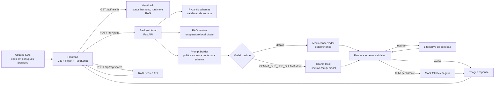
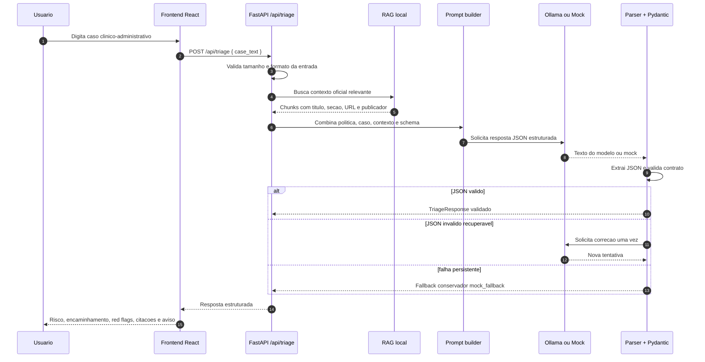
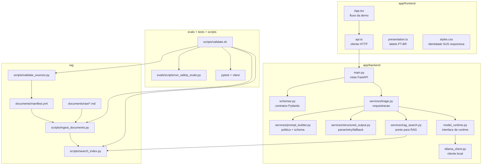
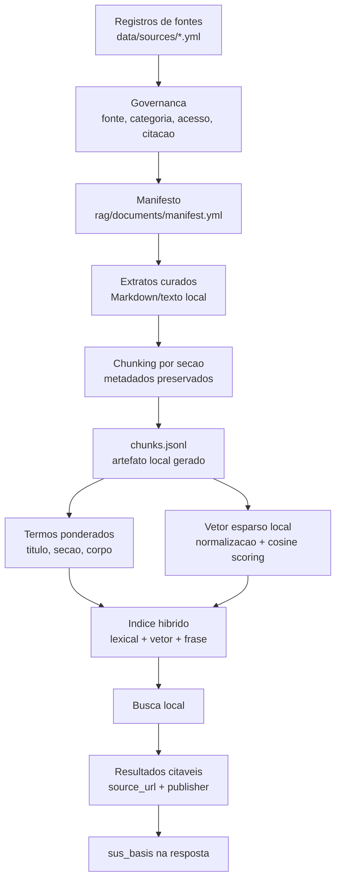
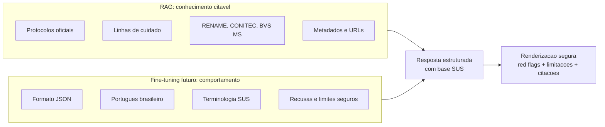
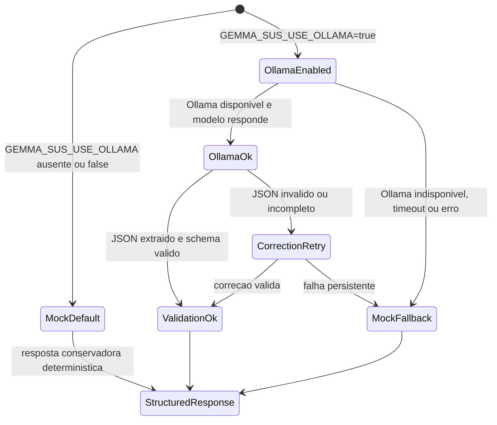

# Gemma SUS Assistant

Assistente web **local-first** para fluxos clinico-administrativos do SUS. O projeto combina interface React, backend FastAPI, RAG local sobre materiais publicos/oficiais, saidas JSON estruturadas e runtime local via Ollama/Gemma quando habilitado.

> Este projeto nao e um produto de diagnostico automatico. Ele apoia triagem, orientacao administrativa, roteamento SUS, documentacao e seguranca operacional. A resposta sempre deve preservar limites claros: nao substitui avaliacao profissional, nao prescreve medicamentos controlados e deve escalar sinais de alarme para UPA, emergencia ou SAMU 192 conforme o caso.

## Contexto e problema

Modelos medicos generalistas normalmente foram treinados e avaliados em contextos que nao representam bem a operacao cotidiana da saude publica brasileira. No SUS, uma orientacao util nao depende apenas de sintomas: ela precisa entender linguagem local, caminhos de acesso, pontos da rede e restricoes administrativas.

Exemplos de termos e situacoes que o projeto trata como contexto de produto:

- **UBS**, **UPA**, **SAMU 192**, acolhimento e classificacao de risco.
- Encaminhamento, regulacao, retorno para atencao primaria e acompanhamento.
- Abreviacoes comuns como **PA 18x12**.
- Demandas administrativas como renovacao de encaminhamento ou receituario azul.
- Necessidade de diferenciar orientacao administrativa de sinal de alarme clinico.

O objetivo e demonstrar uma arquitetura de IA local para saude publica que respeite seguranca, privacidade, citacao de fontes e validacao de saida.

## Proposta do projeto

O Gemma SUS Assistant segue quatro ideias centrais:

1. **Local-first por padrao**: a aplicacao roda localmente e nao chama APIs hospedadas por padrao.
2. **RAG para protocolo**: conhecimento oficial e atualizavel vem de documentos recuperados e citados, nao de memoria do modelo.
3. **Saida estruturada**: o backend valida JSON antes de entregar para a UI.
4. **Seguranca clinico-administrativa**: a interface sempre mostra limitacoes e escalonamento para sinais graves.

O projeto foi pensado para hackathon e pesquisa aplicada: mostrar que um assistente local pode ser adaptado ao vocabulario e aos fluxos do SUS sem vender a ideia de diagnostico automatico. Ele pode apoiar tanto equipes do SUS quanto cidadaos, desde que a experiencia deixe claro que a ferramenta orienta proximos passos seguros e nao substitui atendimento profissional.

## O que o sistema faz hoje

1. Recebe um caso curto em portugues brasileiro.
2. Recupera contexto de documentos locais via RAG.
3. Monta um prompt com politica de seguranca, caso do usuario, contexto recuperado e schema JSON.
4. Usa Ollama quando `GEMMA_SUS_USE_OLLAMA=true`; caso contrario, usa um mock conservador.
5. Extrai e valida a resposta estruturada com Pydantic.
6. Renderiza na interface: risco, encaminhamento, sinais de alarme, base SUS, limitacoes, aviso de seguranca e JSON bruto.

Exemplo de entrada:

```text
Paciente relata PA 18x12, cefaleia forte e falta de ar. Esta na UBS.
```

Exemplo de saida estruturada:

```json
{
  "risk_level": "emergency",
  "summary": "Paciente com pressao arterial muito elevada associada a sintomas de alarme.",
  "suggested_action": "Encaminhar para atendimento de urgencia conforme fluxo local.",
  "referral": "UPA",
  "red_flags": ["falta de ar", "cefaleia forte", "pressao arterial muito elevada"],
  "sus_basis": ["Contexto oficial recuperado via RAG"],
  "limitations": "Esta orientacao nao substitui avaliacao profissional.",
  "safety_notice": "Acionar urgencia se houver piora, falta de ar, dor no peito ou outros sinais graves.",
  "runtime": "mock"
}
```

## Publico-alvo

O publico de interesse inclui dois grupos principais, com responsabilidades e linguagem diferentes:

### Equipes e instituicoes do SUS

- Profissionais e equipes de UBS/UPA que precisam apoiar acolhimento, classificacao de risco, orientacao e encaminhamento.
- Equipes administrativas lidando com renovacao, encaminhamento, regulacao, retorno para UBS e duvidas operacionais.
- Gestores, apoiadores locais e agentes comunitarios interessados em fluxos mais claros e seguros.

### Populacao em geral e usuarios do SUS

- Cidadaos que precisam entender qual caminho procurar: UBS, UPA, SAMU, emergencia, retorno administrativo ou acompanhamento.
- Pessoas com duvidas sobre sinais de alarme, encaminhamentos, renovacao de documentos e orientacoes de acesso ao SUS.
- Familiares ou cuidadores buscando uma explicacao simples, em portugues brasileiro, sobre proximos passos seguros.

Para a populacao geral, a interface deve ser ainda mais explicita: o assistente nao diagnostica, nao prescreve, nao substitui profissional e deve orientar busca de atendimento urgente diante de sinais graves. Uma evolucao futura pode separar a experiencia em dois fluxos: **modo profissional/equipe SUS** e **modo cidadao/paciente**.

Tambem sao publicos importantes avaliadores de hackathon, pesquisadores e desenvolvedores criando ferramentas com RAG, Ollama, FastAPI, React e validacao de seguranca.

## Arquitetura geral



### Por que essa arquitetura

- **Frontend separado**: a UI renderiza campos estruturados, avisos e citacoes sem conhecer detalhes do modelo.
- **Backend como fronteira de seguranca**: entrada, saida e contratos sao validados no servidor local.
- **Runtime substituivel**: Ollama fica atras de uma interface pequena; o mock conserva a demo deterministica.
- **RAG isolado da geracao**: recuperacao e prompt building sao etapas separadas para manter auditabilidade.
- **Sem dependencia hospedada por padrao**: depois de instalar runtime/modelo/documentos, o fluxo pode operar localmente.

## Fluxo de uma solicitacao de triagem



## Arquitetura de modulos



## Fluxo RAG local

O RAG guarda conhecimento oficial e atualizado. Fine-tuning nao deve memorizar protocolos que precisam ser citaveis.



Principios do RAG:

- Preferir fontes oficiais federais: Ministerio da Saude, Linhas de Cuidado, PCDT, RENAME, CONITEC, BVS MS, DataSUS/CNES quando aplicavel.
- Preservar URL, publicador, data de recuperacao e metadados de citacao.
- Manter downloads grandes e arquivos brutos locais fora do Git.
- Commitar apenas extratos pequenos, curados e com proveniencia.
- Nao inferir conduta protocolar alem do trecho oficial citado.

## Separacao entre RAG e fine-tuning



- **RAG**: fatos de protocolo, base oficial, citacoes e contexto local.
- **Fine-tuning**: estilo, disciplina de schema, portugues brasileiro, terminologia e padroes de seguranca.
- **Regra de seguranca**: nao treinar em prontuarios reais ou dados identificaveis sem ADR, autorizacao, desidentificacao e politica LGPD.

## Estados de runtime



## Contrato de saida

A resposta de triagem segue campos estaveis:

```json
{
  "risk_level": "low | moderate | high | emergency",
  "summary": "string",
  "suggested_action": "string",
  "referral": "UBS | UPA | SAMU | emergency | scheduled_follow_up | administrative_guidance | unknown",
  "red_flags": ["string"],
  "sus_basis": ["string"],
  "limitations": "string",
  "safety_notice": "string",
  "runtime": "mock | ollama | mock_fallback"
}
```

Regras importantes:

- `red_flags` e `sus_basis` sempre sao arrays.
- `limitations` deve deixar claro que a resposta nao substitui avaliacao profissional.
- `safety_notice` deve orientar escalonamento diante de piora ou sintomas graves.
- Quando RAG for usado para protocolo, `sus_basis` deve apontar o contexto recuperado.

## Endpoints principais

| Metodo | Endpoint | Funcao |
|---|---|---|
| `GET` | `/api/health` | Status do backend, runtime e indice RAG |
| `POST` | `/api/triage` | Recebe `case_text` e retorna orientacao estruturada |
| `POST` | `/api/rag/search` | Busca trechos locais citaveis no indice RAG |

## Estrutura do repositorio

```text
app/frontend   Interface Vite + React + TypeScript
app/backend    API local FastAPI, schemas, runtime, RAG orchestration
rag            Fontes, ingestao, chunking, indice e testes RAG
finetuning     Datasets sinteticos e esqueleto Unsloth/QLoRA
docs           Guias de aquisicao, demo e metodologia
specs          Memoria persistente do produto, arquitetura e validacao
tasks          Estado de execucao e backlog
scripts        Validacao e loops de desenvolvimento
```

## Como rodar localmente

### Backend

```bash
cd app/backend
python -m venv .venv
. .venv/bin/activate
pip install -e .[dev]
uvicorn app.main:app --reload --port 8000
```

### Frontend

```bash
cd app/frontend
npm install
npm run dev
```

Por padrao, o frontend espera o backend em `http://localhost:8000`. Para alterar:

```bash
VITE_API_BASE_URL=http://localhost:8000 npm run dev
```

### Ollama local opcional

O backend usa mock conservador por padrao. Para habilitar Ollama:

```bash
GEMMA_SUS_USE_OLLAMA=true \
GEMMA_SUS_OLLAMA_BASE_URL=http://localhost:11434 \
GEMMA_SUS_OLLAMA_MODEL=gemma3:4b \
uvicorn app.main:app --reload --port 8000
```

O nome do modelo pode mudar conforme a disponibilidade local da familia Gemma no Ollama.

## Validacao

Comando padrao:

```bash
bash scripts/validate.sh
```

O script executa, quando as ferramentas existem:

- Frontend: lint, typecheck, testes e build.
- Backend: Ruff, mypy e pytest.
- Safety evals deterministicas.
- Validacao de fontes RAG.
- Ingestao e build do indice RAG.

Avaliacoes live com Ollama sao opcionais:

```bash
GEMMA_SUS_RUN_LIVE_OLLAMA_EVALS=true python -m evals.scripts.run_live_ollama_evals
```

Validacao de fine-tuning fica opt-in enquanto o foco e RAG/demo:

```bash
GEMMA_SUS_VALIDATE_FINETUNING=true bash scripts/validate.sh
```

## Roadmap resumido

- [x] Shell web local com FastAPI + React.
- [x] Runtime mock e integracao Ollama opt-in.
- [x] Schema estruturado e retry/reparo de JSON.
- [x] Safety evals SUS deterministicas.
- [x] RAG local com fontes, ingestao, citacoes e indice hibrido lexical/vetor esparso.
- [x] Interface demo responsiva com identidade SUS.
- [ ] Guia final de instalacao local/offline para usuario nao tecnico.
- [ ] Aquisicao e revisao de datasets publicos para fine-tuning.
- [ ] Treino QLoRA real fora do CI.

## Principios de seguranca

- Nao usar APIs hospedadas por padrao.
- Nao persistir texto clinico identificavel.
- Nao commitar dados de pacientes, `.env`, credenciais ou downloads grandes.
- Nao prometer diagnostico, prescricao ou substituicao de profissional.
- Escalar sinais de alarme para UPA, emergencia ou SAMU.
- Preferir base oficial recuperada por RAG para orientacao especifica de protocolo.

## Documentos importantes

- `AGENTS.md`: contrato operacional dos agentes.
- `specs/product.md`: visao e posicionamento.
- `specs/requirements.md`: requisitos e restricoes.
- `specs/architecture.md`: arquitetura alvo e regras.
- `specs/api-contracts.md`: contratos de schema e endpoints.
- `specs/data-sources.md`: politica de fontes RAG/fine-tuning.
- `specs/validation.md`: validacao esperada.
- `docs/demo-script.md`: roteiro de demonstracao.
